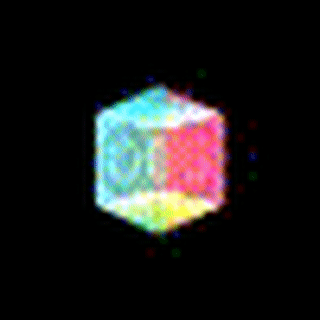

# plenoxels-pytorch

This is a (hopefully) well-commented implementation of Plenoxels in PyTorch (more comments are still being added to improve explainability). The relevant paper is [Plenoxels: Radiance Fields without Neural Networks](https://arxiv.org/abs/2112.05131).

The theoretical background is explained in a series of posts below. Additionally, the incremental build-up of the code will hopefully aid in a more ground-up understanding.

- [Part 1](https://avishek.net/2022/12/04/pytorch-guide-plenoxels-nerf-part-1.html)
- [Part 2](https://avishek.net/2022/12/05/pytorch-guide-plenoxels-nerf-part-2.html)
- [Part 3](https://avishek.net/2022/12/07/pytorch-guide-plenoxels-nerf-part-3.html)
- [Part 4](https://avishek.net/2022/12/18/pytorch-guide-plenoxels-nerf-part-4.html)
- [Part 5](https://avishek.net/2022/12/19/pytorch-guide-plenoxels-nerf-part-5.html)
- Part 6 (Work In Progress)

## Usage
Currently, the code is set to reconstruct a cube from 13 views of it. These views are stored in ```images/cube/training```. The corresponding camera positions are in ```cube_training_positions()```. Simply running ```plenoxels.py``` will do the training, and store the reconstructed world in ```reconstructed.pt```. It will also show the reconstructed views from the original training viewpoints in the ```images/frames``` directory. The renderings during the training (which will be stochastic samples) are stored in the ```images/reconstruction``` directory.

## Example Reconstructions
**Training**



**Reconstruction**


**Partial Reconstruction of a Table from a Single Image**


**Training Image of a Table**


**Note:** The table image above is taken from the [Amazon Berkeley Objects Dataset](https://amazon-berkeley-objects.s3.amazonaws.com/index.html). The ABO Dataset is made available under the [**Creative Commons Attribution-NonCommercial 4.0 International Public License (CC BY-NC 4.0)**](https://creativecommons.org/licenses/by-nc/4.0/).
